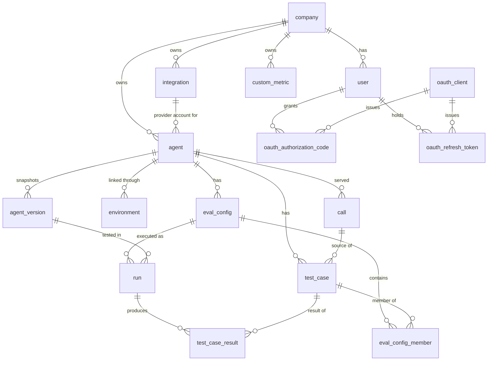

# Data model

The models in `backend/app/models/` are the single description of the schema. This page
is a map, not a column reference: read the model file for fields, and keep this page to
what the code cannot tell you (what each table is for and where it is heading).

A test (`test_models_match_migrated_schema`) fails when models and migrations disagree,
so the models are always what the database actually has.

## Tables

| Table | Model file | What it holds | Rebuild status |
|---|---|---|---|
| `company` | `company.py` | A tenant, with its LLM credentials (encrypted). | Keep |
| `user` | `user.py` | A login. Each signup creates its own company. | Keep |
| `integration` | `integration.py` | A provider account (Retell, Vapi, ElevenLabs) with an encrypted API key. This is the product's read access to a provider. | Keep |
| `agent` | `agent.py` | A voice agent, linked to a provider agent or to its own HTTP endpoint. | Keep |
| `agent_version` | `agent_version.py` | A snapshot of the agent's prompt, tools and model settings; draft or published. | Reshape in slice 1.5 into observed component versions |
| `environment` | `environment.py` | The link call sync uses to find an agent's provider. | Revisit in slice 1.8 |
| `call` | `call.py` | A production call: transcript plus the provider's raw payload. Retell-specific column names. | Reshape in slice 1.1 into the canonical trace |
| `test_case` | `test_case.py` | A simulated-caller scenario, optionally sourced from a call. | Frozen until Phase 4 |
| `eval_config`, `eval_config_member` | `eval_config.py` | A named set of test cases with a run configuration (runtime, judge, thresholds). | Frozen until Phase 4 |
| `run` | `run.py` | One execution of an eval config against an agent version, with aggregate metrics. | Frozen until Phase 4 |
| `test_case_result` | `test_case_result.py` | One test case's transcript and judge verdict within a run. | Frozen until Phase 4 |
| `custom_metric` | `custom_metric.py` | Judge metrics per company; built-in ones are copied in at signup. | Frozen until Phase 4 |
| `oauth_client`, `oauth_authorization_code`, `oauth_refresh_token` | `oauth.py` | The OAuth server that MCP clients authenticate against. | Keep |

## Conventions

- **Tenancy.** Every tenant-owned table has `company_id`, and every query filters on it.
- **Enums** are VARCHAR columns holding the member's value, declared with
  `enum_type(...)` from `app/models/columns.py`. No Postgres ENUM types.
- **Structured values** that are read and written as a whole live in JSONB columns
  with a Pydantic model in `schemas.py` (run config, transcript turns, judge verdict,
  aggregate metrics).
- **Deleting an agent** cascades to its versions in the database. Runs keep a nullable
  reference to the version they tested.
- **Soft delete** (`deleted_at`) is used on calls, test cases, eval configs and custom
  metrics.
- **Constraints live on the model.** Indexes, partial indexes and `ondelete` rules are
  declared on the model, never in a migration only. See
  [`migrations.md`](./migrations.md).

## Snapshots on runs

A run copies the agent's prompt, tools, model and mode onto itself when it is created,
and records the `agent_version` it tested. A result therefore always shows what was
actually evaluated, even after the agent changes.
